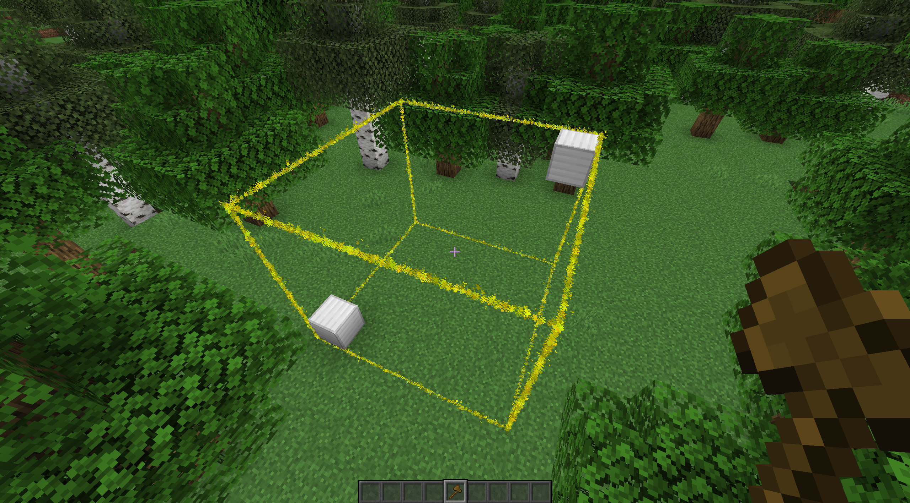

# WorldEdit Selection Viewer

A very simple plugin that adds particle borders for viewing one's selected WorldEdit region.

## Setup

1. Download the jar
2. Put it into your `plugins/` folder
3. Profit!

## Permissions

`worldedit-selection-viewer.view` - If the player can see the borders